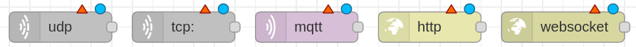

# Auto Suspender

**Batjigdrel Bataa / BB222MF**

With the help of ultrasonic distance sensor users desktop will be suspended automatically whenever user leaves the specified range. To further
increase the accuracy of the distance detection process additional sensors are integrated to the system.

**Amount of time required to replicate the project: ~1 hour**

# Objective

Due to severa lack of time management and self control, my desktop hardly shuts down. Often it hits couple days of uptime. Which is not environment
friendly behaviour and it puts major strain on the desktop computer itself. In order to mitigate the issue however little it may, I chose this project.

Average desktop computers consume several hundred watts. High end computers could consume upwards of over 1kwatts. In order to minimise the power
consumption, suspending the computer is safest and easiest solution due to harmless behaviour towards users workflow by letting the user resume 
their work without major delay. 

By working with this project, one can attain knowledge on intricate details of how certain sensors work, how machines percieve their surrounding.
Further more, what can be done with the newly acquired data.

# Materials used

Component | Part of | Bought at | Price* 
-| -| -| -
fipy                 |LNU - 1DT305 Applied IoT - FiPy and sensors bundle | electrokit.com | 694 SEK**
pysense              |LNU - 1DT305 Applied IoT - FiPy and sensors bundle | electrokit.com | 317 SEK**
Jumper wires         |LNU - 1DT305 Applied IoT - FiPy and sensors bundle | electrokit.com | 100 SEK**
Bread board          |LNU - 1DT305 Applied IoT - FiPy and sensors bundle | electrokit.com | 100 SEK**
Micro USB cable      |LNU - 1DT305 Applied IoT - FiPy and sensors bundle | electrokit.com | 100 SEK**
HC-SR04 sensor       || amazon.se | 112 SEK

\* All prices are approximates.

\** Components were part of a kit, thus they may be cheaper when bought individually.


---

**Figure 1**: pycom fipy. 


The microcontroller used in this project. Responsible for reading data from connected sensors and sending the data to given remote server. Can 
read data from both Digital and Analog sensors. Capable of following wireless communicaion protocols:

    -Wifi 
    -LoRa
    -LTE
    -SigFox 
    -Bluetooth

**Figure 2**: pycom pysense. 


Additional board which gives access to SD card reader, battery connection, and 5 more built-in sensors for the connected microcontroller. However,
this board covers up all the pins on the microcontroller blocking the further connection to different sensors. Additional wiring is required to
expose the pins.

:speech_balloon: For this project, Expansion board with external DHT11/22 sensor might be more suitable. However in my case pysense is 
used due to time and budget limitations.

**Figure 3**: Jumper wires. 


Main connection method used in this project. It is a Male-to-Male type.

**Figure 4**: Bread board. 


Serve as a base of connection. Board is divided into two halves. Each halve has horzintal internal connection. Meaning, under the hood 'a' pin 
is connected to 'b' ping next to it, same goes for rest of the pin untill 'e'. The right half of the board follows same pattern, letter 'f'
through 'j' is connected but not with the any pin above or below the row. Only exception is power rails denoted by the red and blue lines along
the left and right edges. Unlike general pins in the middle, power pins are connected vertically, along coloured lines.

**Figure 5**: HC-SR04 ultrasonic distance sensor. 


A sensor that uses ultrasonic sound wave to detect the distance. It sends sound wave then catches the echo of it when it bounces back on 
nearest object. Speed of sound will be used to complete the calculation. 


# Computer setup 

With the components at hand, next thing to prepare is how the software side of things are handled. First, text editor of choice, I have used the 
Visual Studio Code, a well known main stream IDE. However plugin for interfacing with the microcontroller behaves oddly in certain scenario on 
my machine when using Visual Studio Code. Thus, uploading and interacting with the microcontroller will be handled by Atom IDE. Specifically 
PyMakr plugin on Atom IDE. If you comfortable with using Atom, I suggest solely using Atom since you won't have to juggle between programs. 
On the other hand, if you have a prefered text editor, you can use that to write the code and use Atoms PyMakr plugin to only run and upload
the code to microcontroller.

## Steps - Can be followed on Arch Linux

1. Installing Atom
```
yay -S atom
```

The package manager should take care of all the dependencies. In case installation process yield conflict error concerning Node.js, try removing
any existing version of Node.js from your system. Reason is Atom uses older version of Node.js as of writing this.

2. Installing PyMakr

After installing Atom, a plugin called PyMakr is required to connect to the microcontroller. Installation process is illustrated in the following
[link](https://docs.pycom.io/gettingstarted/software/atom/).

3. Updating firmware

Finally, it is recommended to update the firmware of your microcontroller. With pycom devices, official program is provided from the vendor, which 
can be downloaded from the following [link](https://software.pycom.io/downloads/linux-1.16.5.html). When doing so on Linux additional packages are 
required.

```
pacman -S dialog
pacman -S python-pyserial
```

---

Following programs will be used in later parts of the project.

4. Installing Node-RED
```
npm install -g --unsafe-perm node-red
```
5. Installing MongoDB
```
yay -S mongodb
yay -S mongodb-compass
```

:exclamation: Commands mentioned  in this section might require root privilege. Please use tools like doas, sudo, etc to assume the identity of root user. 
Otherwise, login as a root, which is bad practice but it is your machine in the end. 

# Putting everything together:

**Figure 6**: Wiring. 


Connection between pysense and fipy follows exact connection of how it would have connected if we plug the two directly. Only difference is our 
connection leave some of the fipys pins exposed. By doing so, we can attach the external HC-SR04 sensor. Which has 4 pins, Vcc, Trig, Echo, Gnd. Vcc pin
is connected to 5v rail on the bottom which draws power from left most pin on the top of fipy; orientation follows the picture shown on figure 6.
The external sensor is grounded on top most rail of the breadboard which is connected to second pin from the top left of fipy, next to the 5v pin.
Afterwards, Trig pin is connected to bottom fourth pin from the right. Finally, Echo ping is connected right next to the Trig pin.

As our system will be used indoor next to the desktop, power will be  provided from the desktop itself. Meaning, power consumption of the system should
not be a issue. If the microcontroller is connected to USB 3.0 port it can deliver up to 900mA current. According to the official 
documentation fipy consumes 137mA when in WiFi client mode. Additionally, HC-SR04 sensor consumes 15mA when actively working. The total
current consumption of the system sums up to ~152mA which puts it roughly around Low-power device category of USB 3.0 power standars. Finally, since 
USB 3.0/2.0 is 5v, total power consumption of the system will be 0.76 watts.

# Platform

Auto Suspender uses Node Red for managing the data recieved from the microcontroller by filtering, transmiting, and executing. The platform is 
chosen due to how much possiblity it offers. Since it is self hosted and offers drag-n-drop style coding blocks, a functionality user can achieve
is vast. Thus the platform is chosen without doubt. 

As I mentioned above, this platform is self hosted, meaning no additional fee is required than operational cost of the host machine.

**Figure 7**: Node-Red input options. 



Node-Red can recieve packets from the microcontroller through UDP, TCP, MQTT and few more options. In this project UDP protocol will be used due
to ease of use. Furthermore, other options doesn't offer noticeable difference in our use case. The UDP message will contain JSON formated 
message. 

**Figure 8**: Node-Red 'function' block. 


With the message recieved at Node-Red, 'function' blocks can be used to filter the specific data from the message. After filtered, 
message can be sent to chosen dashboard node to be illustrated. Furthermore, addendum to showing the data on the dashboard, filtered data can be 
uploaded to connected MongoDB; Node-Red offers dedicated block for this. 

**Figure 9**: Node-Red 'exec' block. 


Finally, Node-Red can execute given system commands through its 'exec'
block. Command to execute can be provided from either the message sent from the microcontroller or from the block itself.

Cloud based platform features are limited to what the vendor provides thus Node-Red should offer more options. On the downside it may lack when 
it comes to visual aesthetics. However, as that is not the main concern of this project it won't affect the choice. 

Scaleability considred, since this system is meant for single user, Node-Red running on local machine should be able to handle the demand with ease. 

# The code

Calculating the distance
---
Ultrasonic distance sensor works by sending high-frequency(40kHz) sound waves from the *Trigger* pin then catching the bounced echo on *Echo* pin.
```python
ECHO = Pin('P10', mode=Pin.IN) 
TRIGGER = Pin('P9', mode=Pin.OUT)
```
In order to ouput a soundwave, mode of the pin connected to *Trigger* should be *OUT*. As for the *Echo* it should be *IN*.  According to the 
connection diagram on *Figure 6*, pins mentioned above will be *P10* and *P9*.

```python
def calculateTime():
    # TRIGGER pulse LOW for 2us (just in case)
    TRIGGER(0)
    utime.sleep_us(2)
    # TRIGGER HIGH for a 10us pulse
    TRIGGER(1)
    utime.sleep_us(10)
    TRIGGER(0)

    # Wait for the rising edge of the ECHO then start timer
    while ECHO() == 0:
        pass
    start = utime.ticks_us()

    # Wait for end of ECHO pulse then stop timer
    while ECHO() == 1:
        pass
    finish = utime.ticks_us()

    # Pause for 20ms to prevent overlapping ECHOs
    utime.sleep_ms(20)

    return (utime.ticks_diff(start, finish))
```
In the *calculateTime* method, sound wave is emited for duration of 10 nano seconds. Afterwards, starting time of the emission noted on 
*start* variable. Finally, when *Echo* pin recieves a sound wave, time it arrived is saved on *finish* variable. At the end of the method,
it returns time difference between the two noted time. Which indicates round trip time of the sound wave.

```python
def calculateDistance(temp):
    # SoundSpeed = 20.05 * (Tk)**0.5
    # Tk = 273.15 + Tc
    soundSpeed = 20.05 * (273.16 + temp) ** 0.5
    print("Speed of sound in current environment: ", round(soundSpeed))

    # Distance to an object = ((speed of sound in the air)*time)/2
    time = calculateTime()
    soundSpeed /= -10000
    distance = (time * soundSpeed)/2
    print("Distance from the monitor to user: ", round(distance), "cm.")
    return round(distance)
```
The *calculateDistance* method uses speed of sound and the time from previous method to calculate distance between the sensor and any object in
front of it. During the calculation temperature is used to improve the accuracy. The speed of sound is affected by several factors. Including,
Humidity and Air pressure, however the degree which those two affect are minimal to the point where it can be ignored safely for this project.
More important factor is ambient temperature, which makes noticeable difference. In most calculations ambient temperature is assumed to be 20 
degree celsuis which results 343m/s speed of sound. In my current environment sound will travel 5m/s faster due to 8 degree warmer
condition. With the temperature factor considered, distance will be calculated by dividing round trip distance by two. 

The temperature used in the distance calculation is collected from the built-in sensor of pysense. The pycom provides necessary [files and a 
instruction](https://docs.pycom.io/tutorials/expansionboards/sensing/) to use the sensors.

P.S. Meter per Second is converted to Cintemeter per Nanosecond in calculation.


Verifying the absence of a user.
---
In order mitigate false reads and possible inconvienences caused by instant suspend, verification steps are added. 
```python
absenceCnt = 0
```
First, dedicated counter variable is declared with value zero inside main method above the infinite loop.

```python
# Update distance every second.
distance = DistanceSensor.calculateDistance(temp)
if (distance > 70):
    absenceCnt += 1
elif (distance <= 70 and absenceCnt != 0):
    absenceCnt -= 1
```
Previously declared variable is increased every time sensor doesn't detect any object inside 70cm perimeter in front of the sensor inside 15
degree window. If sensor continue to not detect any object for the next 4 successive read system consider user left the desktop and proceeds
to next action. However, during this successive reads, if sensors returns below 70 value, *absenceCnt* variable is decreased by one. Making 
the verification level lower and if this continues, system will return to initial state.

```python
if (absenceCnt == 5):
    absenceCnt = 0
```
If system succesfully verify user is left, counter is resetted. By the time counter resets, Node-Red should be executing suspend command.

```javascript
if (verify == 5){
    let executionInfo = {"Date": utc, "CommandExecuted": command};
    msg.payload = executionInfo;
    return msg;
}
```
Code snippet above is from the Node-Red block, written in JavaScript. The *absenceCnt* variable is sent to Node-Red and double checked there
before continueing.

Network connection
---

```python
wlan.connect('WorldsFastestWiFi', auth=(WLAN.WPA2, '42069'))
```
When connecting to the WiFi, name of the WiFi and the password should be replaced on the line above, inside *boot.py* file.

# Transmitting the data / connectivity

The microcontroller sends JSON containing all the sensor value every seconds. However, not every value inside are updated at the same rate. For 
instance, humidity and temperature values are updated every 20 seconds. The distance and verification counter are updated at same rate as 
the upload rate. At last, the command variable is constant and updated manually by user, if desires.
```python
resultDict = {
    "Humidity":    str(humid),
    "Temperature": str(temp),
    "Distance":    str(distance),
    "Verify":      str(absenceCnt),
    "Command":     command
}

message = build_json(resultDict)
```
Package above is sent through WiFi using UDP protocol. Once the package is sent Node-Red recieves it through 'upd-in' block. On the block, port 
to be used is specified.

**Figure 10**: Editing 'udp-in' block.


Now on the microcontroller side, same port number is used along with IP address of the host machine running the Node-Red.
```python
def sendData(message, expectResponse):
    addr = socket.getaddrinfo('192.168.43.202', 1880)[0][-1]
    s.sendto(message, addr)
    print('Message sent.')
```

The WiFi is most logical solution to the connection requirement of this project. Since, connection is made between the desktop and the 
microcontroller in a same room. Long range was not the requirement. Neither power consumption due to how the system is basically connected to
the wall plug, albeit through the desktop itself. Regardless of the situation, initially LoRa connectivity was tested. Unfortunately, 
quality of the Helium coverage in the area was too weak to acknowledge the connection attempt. The Things Network had no coverage at all.

Due to the advantages mentioned above, rate at data is sent is catered toward responsivenes of the system.

Connection between the microcontroller and the desktop is solely one way connection, where data flows from microcontroller to desktop. Thus UDP 
protocol serves the purposes without issue. Additionally, due to WiFi being used protocols with optimized package sizes, such as MQTT 
is not necessary.

# Presenting the data

Data is preserved for indefinite amount of time. Since, data is stored locally. 
New entry is added to the database in two situation. 

    - Change in temperature or humidity: New temperature and humidity is uploaded.
    
    - Verified absence of a user: The command and date and time at which it got executed.

First condition is achieved through 'function' block in Node-Red. Previous state of each humidity and temperature is saved inside a variable. 
Whenever knew data arrive, it is compared to the old data and only if at least one of them is different, data is uploaded to the database.
```javascript
if (humid != oldHumid || tempe != oldTempe){
    oldHumid = humid;
    oldTempe = tempe;
    
    let envData = {"Humidity": humid, "Temperature": tempe};
    msg.payload = envData;

    return msg;
}
```

MongoDB is used as a databse in this system. Main reason is well integration with Node-Red. A dedicated block is used to write new data to 
MongoDB, where user only need to specify 
1. Database name 
2. Collection name
3. Operation

As name suggest, this system suspends the users desktop based on the absence of a user. This action is triggered by value called 'verify'. How 
this value fluctuates depending on the different distances user appear from the desktop is explained on **The code** part.
If the value hits 5, Node-Red executes following command sent from the microcontroller:
```bash
systemctl suspend
```

:grey_exclamation: Command above is only executeable on a Linux machine running init system *SystemD*. The command may vary depending on the 
init system and/or operating system.

**Figure 11**: Dashboard.


# Finalizing the desing

As a whole project, goal is achieved. However given additional time there is plenty more stuff to try out, improve upon.

First, implementing this system on a generic ESP32 board. Due to limitations and work around methods imposed by pysense board, project ended up costing 
more than it should and wasted several sensors that never used on the project. Additionally, more wiring is required. If the project was 
developed on ESP32 board with dedicated sensors, process would be more streamlined and cost effective. Another way could be using 'Expansion Board'
from pycom.

Secondly, investing some time into custom PCB board and working on the conneciton between sensor and the microcontroller to make it more robust.
Possibly 3D printing shell to protect it and mount it.

**Figure 12**: Node-RED whole setup.


**Figure 13**: MongoDB structure.


**Figure 14**: MongoDB EnvironmentReadings collection entries.


**Figure 15**: MongoDB DistanceValues collection entries.


**Figure 16**: Top down view.


**Figure 17**: Front view.

