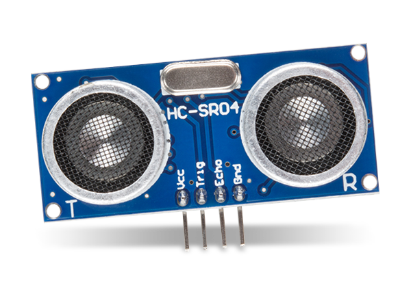

# Auto Suspender

**Batjigdrel Bataa / BB222MF**

With the help of ultrasonic distance sensor users desktop will be suspended automatically whenever user leaves the specified range. To further
increase the accuracy of the distance detection process additional sensors are integrated to the system.

**Amount of time required to replicate the project: ~1 hour**

# Objective

Due to severa lack of time management and self control, my desktop hardly shuts down. Often it hits couple days of uptime. Which is not environment
friendly behaviour and it puts major strain on the desktop computer itself. In order to mitigate the issue however little it may, I chose this project.

Average desktop computers consume several hundred watts. High end computers could consume upwards of over 1kwatts. In order to minimise the power
consumption, suspending the computer is safest and easiest solution due to harmless behaviour towards users workflow by letting the user resume 
their work without major delay. 

By working with this project, one can attain knowledge on intricate details of how certain sensors work, how machines percieve their surrounding.
Further more, what can be done with the newly acquired data.

# Materials used

Component | Part of | Bought at | Price* 
-| -| -| -
fipy                 |LNU - 1DT305 Applied IoT - FiPy and sensors bundle | electrokit.com | 694 SEK**
pysense              |LNU - 1DT305 Applied IoT - FiPy and sensors bundle | electrokit.com | 317 SEK**
Jumper wires         |LNU - 1DT305 Applied IoT - FiPy and sensors bundle | electrokit.com | 100 SEK**
Bread board          |LNU - 1DT305 Applied IoT - FiPy and sensors bundle | electrokit.com | 100 SEK**
Micro USB cable      |LNU - 1DT305 Applied IoT - FiPy and sensors bundle | electrokit.com | 100 SEK**
HC-SR04 sensor       || amazon.se | 112 SEK

\* All prices are approximates.

\** Components were part of a kit, thus they may be cheaper when bought individually.


---
**Figure 1**: pycom fipy. 
The microcontroller used in this project. Responsible for reading data from connected sensors and sending the data to given remote server. Can 
read data from both Digital and Analog sensors. Capable of following wireless communicaion mediums:

    -Wifi 
    -LoRa
    -LTE
    -SigFox 
    -Bluetooth

**Figure 2**: pycom pysense. 
Additional board which gives access to SD card reader, battery connection, and 5 more built-in sensors for the connected microcontroller. However,
this board covers up all the pins on the microcontroller blocking the further connection to different sensors. Additional wiring is required to
expose the pins.
:grey_exclamation: For this project, Expansion board with external DHT11/22 sensor might be more suitable. However in my case pysense is 
used due to time and budget limitations.

**Figure 3**: Jumper wires. 
Main connection method used in this project. It is a Male-to-Male type.

**Figure 4**: Bread board. 
Serve as a base of connection. Board is divided into two halves. Each halve has horzintal internal connection. Meaning, under the hood 'a' pin 
is connected to 'b' ping next to it, same goes for rest of the pin untill 'e'. The right half of the board follows same pattern, letter 'f'
through 'j' is connected but not with the any pin above or below the row. Only exception is power rails denoted by the red and blue lines along
the left and right edges. Unlike general pins in the middle, power pins are connected vertically, along coloured lines.

**Figure 5**: HC-SR04 ultrasonic distance sensor. 
A sensor that uses ultrasonic sound wave to detect the distance. It sends sound wave then catches the echo of it when it bounces back on 
nearest object. Speed of sound will be used to complete the calculation. 


# Computer setup 

With the components at hand, next thing to prepare is how the software side of things are handled. First, text editor of choice, I have used the 
Visual Studio Code, a well known main stream IDE. However plugin for interfacing with the microcontroller behaves oddly in certain scenario on 
my machine when using Visual Studio Code. Thus, uploading and interacting with the microcontroller will be handled by Atom IDE. Specifically 
PyMakr plugin on Atom IDE. If you comfortable with using Atom, I suggest solely using Atom since you won't have to juggle between programs. 
On the other hand, if you have a prefered text editor, you can use that to write the code and use Atoms PyMakr plugin to only run and upload
the code to microcontroller.

## Steps - Can be followed on Arch Linux

1. Installing Atom
```
yay -S atom
```

The package manager should take care of all the dependencies. In case installation process yield conflict error concerning Node.js, try removing
any existing version of Node.js from your system. Reason is Atom uses older version of Node.js as of writing this.

2. Installing PyMakr

After installing Atom, a plugin called PyMakr is required to connect to the microcontroller. Installation process is illustrated in the following
[link](https://docs.pycom.io/gettingstarted/software/atom/).

3. Updating firmware

Finally, it is recommended to update the firmware of your microcontroller. With pycom devices, official program is provided from the vendor, which 
can be downloaded from the following [link](https://software.pycom.io/downloads/linux-1.16.5.html). When doing so on Linux additional packages are 
required.

```
pacman -S dialog
pacman -S python-pyserial
```


# Putting everything together:

**Figure 6**: Wiring. 
Connection between pysense and fipy follows exact connection of how it would have connected if we plug the two directly. Only difference is our 
connection leave some of the fipys pins exposed. By doing so, we can attach the external HC-SR04 sensor. Which has 4 pins, Vcc, Trig, Echo, Gnd. Vcc pin
is connected to 5v rail on the bottom which draws power from left most pin on the top of fipy; orientation follows the picture shown on figure 6.
The external sensor is grounded on top most rail of the breadboard which is connected to second pin from the top left of fipy, next to the 5v pin.
Afterwards, Trig pin is connected to bottom fourth pin from the right. Finally, Echo ping is connected right next to the Trig pin.

As our system will be used indoor next to the desktop, power will be  provided from the desktop itself. Meaning, power consumption of the system should
not be a issue. If the microcontroller is connected to USB 3.0 port it can deliver up to 900mA current. According to the official 
documentation fipy consumes 137mA when in WiFi client mode. Additionally, HC-SR04 sensor consumes 15mA when actively working. The total
current consumption of the system sums up to ~152mA which puts it roughly around Low-power device category of USB 3.0 power standars. Finally, since 
USB 3.0/2.0 is 5v, total power consumption of the system will be 0.76 watts.

# Platform

Auto Suspender uses Node Red for managing the data recieved from the microcontroller by filtering, transmiting, and executing. The platform is 
chosen due to how much possiblity it offers. Since it is self hosted and offers drag-n-drop style coding blocks, a functionality user can achieve
is vast. Thus the platform is chosen without doubt. 

As I mentioned above, this platform is self hosted, meaning no additional fee is required than operational cost of the host machine.

**Figure 7**: Node-Red input options. 
Node-Red can recieve packets from the microcontroller through UDP, TCP, MQTT and few more options. In this project UDP protocol will be used due
to ease of use. Furthermore, other options doesn't offer noticeable difference in our use case. The UDP message will contain JSON formated 
message. 

**Figure 8**: Node-Red 'function' block. 
With the message recieved at Node-Red, 'function' blocks can be used to filter the specific data from the message. After filtered, 
message can be sent to chosen dashboard node to be illustrated. Furthermore, addendum to showing the data on the dashboard, filtered data can be 
uploaded to connected MongoDB; Node-Red offers dedicated block for this. 

**Figure 9**: Node-Red 'exec' block. 
Finally, Node-Red can execute given system commands through its 'exec'
block. Command to execute can be provided from either the message sent from the microcontroller or from the block itself.

Cloud based platform features are limited to what the vendor provides thus Node-Red should offer more options. On the downside it may lack when 
it comes to visual aesthetics. However, as that is not the main concern of this project it won't affect the choice. 

Scaleability considred, since this system is meant for single user Node-Red should be able to handle the demand with ease. 

# The code


# Transmitting the data / connectivity


# Presenting the data